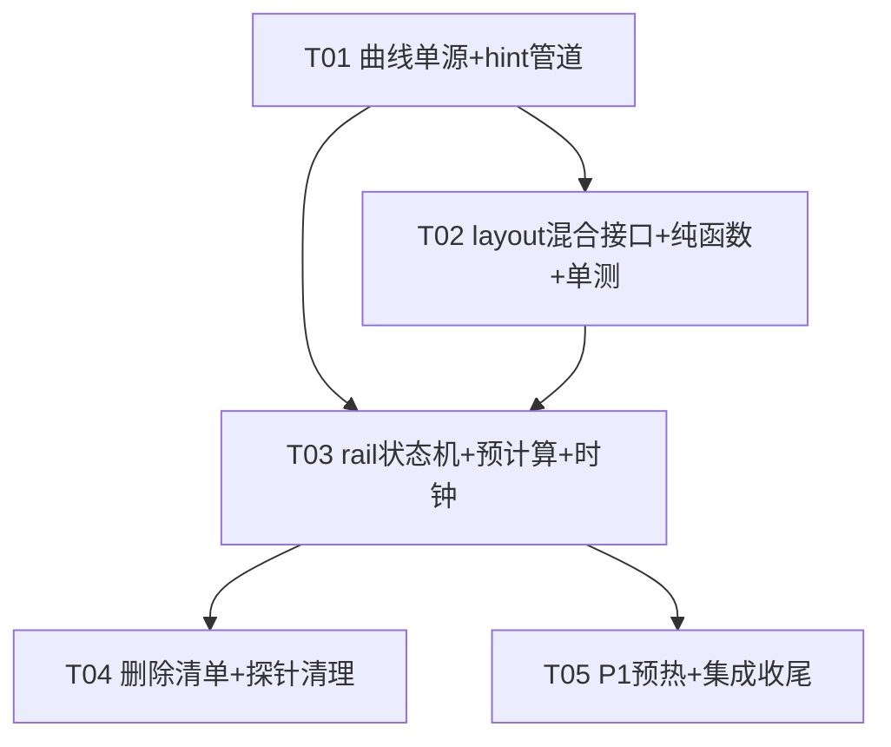

# 侧栏开合确定性宽度动画——架构定稿（Bob / 高见远）

> 策略已拍板：预计算 + 插值 + 精确锚定，方向不重议。本文档只做接口细节、状态机、边界场景、文件级任务清单。
> 行号基准 ff3723f，仅作辅助；任务执行时一律按特征代码实读定位。

---

## Part A · 系统设计

### 0. 已核实的关键事实（实读结论）

1. **WOAppFrame.swift**：`center` 闭包签名 `() -> Center`（:24）；`cols` 在 body 内由 `WOColumnSolver.compute` 求出（:69-89），全屏折算 `center: 0`（:84-86）；列宽动画是 `.modifier(WOColumnsAnimation)` 的 `.animation(motion, value: key)`（:157/:174）——**SwiftUI 只插值渲染帧，body 求值即刻拿到终点值 cols.center**。故 center 闭包拿到的 width 参数=按下那一刻的确定目标宽（每来源一次下发，非逐帧）。
2. **WORootFrame.swift**：`mainFrame`（:174-188）构造 WOAppFrame，`center: { centerRegion }`（:185）；`centerRegion`（:395-418）构造 `WOChatView(environment:sessionId:onToggleRightSidebar:onOpenAgentBrowser:)`（:400）。
3. **WOChatView.swift**：struct View，两个 init（:95 environment 版 / :117 直注版）；`messageList`（:718）构造 representable `WOMessageListView(viewModel:nodes:phase:sessionId:bottomAllowance:onBackgroundTap:...)`。注入形态定为：**新增存储属性 `widthHint`（默认 0），两个 init 各加带默认值参数**——所有既有调用点（含测试/直注版）零破坏。
4. **WOMessageListView.swift（representable）**：`updateUIViewController`（:80-87）→ `core.applyUpdate(...)`。hint 走同管道，`applyUpdate` 尾部消费。
5. **WOMessageListCore**（已逐段核对）：fluid 机器完整面 = `fluidReflowActive/fluidStartedAt/isInsideDualPass/fluidAnchor/fluidHeights/pendingWidth/widthSwitchTimer` 七状态 + `handleLiveWidthChange`(:1333)/`scheduleWidthSwitchRetry`(:1366)/`trySwitchLayoutWidth`(:1375) + viewDidLayoutSubviews 巡检(:1680)/归位块(:1684)/双排版块(:1711)/逐帧补偿块(:1744) + `heightForItemAt` fluid 分支(:2231-2249，:2242 近似) + `nodeHeightChanged` fluid 门(:1072-1087) + `applyUpdate` 尾 retry 钩子(:657-660) + `loadView` 的 `onLiveWidthChange` 接线(:455-457)。
6. **WOHostSizingPool**：`height/remeasure/measureOnly/forceHeight/rekeyWidth/cachedHeight` 语义齐备；离屏 host 已 `safeAreaRegions.remove(.all)`（与显示 cell 同参）。
7. **Motion.swift**：`WOMotion.bezier` = `.timingCurve(0.4, 0, 0.2, 1, duration:)`（:55-57）——控制点硬编码在唯一动画供货处，rail 采样器必须与它同源。
8. **WOFluidDiag**：note 直写/record 环形/dump 落盘，形态不动，只增删事件标签。

---

### 1. 实现路径（难点与选型）

**核心难点**：把"动画期逐帧试探高度（SwiftUI 回传 + 近似 + 双排版）"换成"两端已知布局的确定性插值"。三个支点：

| 支点 | 方案 | 依据 |
|---|---|---|
| 目标宽何时可知 | SwiftUI body 求值即刻下发 `cols.center`（SwiftUI 动画不改变状态值） | 实读 WOAppFrame :69/:134/:157 |
| 两端布局怎么来 | 旧端=当前 `itemFrames`（prepare 产物快照）；新端=池在目标内容宽的身高预计算完成后 O(n) 累加 | 池 `remeasure` 同步量高 + 4ms/8ms 切片既有模式 |
| 帧怎么生成 | `WOMessageListLayout.beginRail/updateRailProgress(p)`：O(n) 线性混合 itemFrames，rail 期 prepare 早退、零量高查询 | R4；行宽=frame.width 插值 |

**架构模式**：不引入新框架。新增一个纯函数曲线采样器（Motion.swift 单源）+ core 内一条 rail 状态机（复用 motionLink CADisplayLink 基建）+ layout 三方法混合接口。SwiftUI 侧只做"管道"（hint 逐跳下发），UIKit 侧做全部几何。

---

### 2. 文件清单（本批涉及）

```
WanWo/UI/Motion/Motion.swift                    —— 改：rail 曲线采样器 + 时长常量单源
WanWo/UI/Frame/WOAppFrame.swift                 —— 改：center 闭包加 width 参数
WanWo/UI/Frame/WORootFrame.swift                —— 改：centerRegion(widthHint:) 逐跳
WanWo/UI/Chat/WOChatView.swift                  —— 改：widthHint 存储属性 + init 参数
WanWo/UI/Chat/List/WOMessageListView.swift      —— 改（主战场）：representable + layout 混合接口 + core rail 状态机 + 删除清单
WanWo/UI/Chat/List/WOMessageListSupport.swift   —— 改：帧混合纯函数（单测直呼）
WanWo/UI/Chat/List/WOFluidDiag.swift            —— 改：探针事件增删（注释/语义）
WanWo/UI/Chat/List/WOHostSizingPool.swift       —— 改（P1）：预热批量查询 helper
WanWoTests/（新增 rail 曲线/混合纯函数测试文件）  —— 增
```

**不涉及**：WOLayout.swift（契约/Store 不动）、WONodeContent.swift（WOHeightReporting 不动）、sync/apply、生长动画、离屏冻结、回底钮、扩窗锚定、报告桥。

---

### 3. 数据结构与接口（新/改状态清单，精确到属性名与类型）

#### 3.1 Motion.swift（曲线单源，R3）

```swift
public enum WORailCurve {
    /// 列宽 rail 采样控制点——**唯一来源**；WOMotion.bezier 改为消费本常量
    /// （消除 0.4,0,0.2,1 的第二份硬编码）。
    public static let controlPoints: (Double, Double, Double, Double) = (0.4, 0, 0.2, 1)
    /// 给定线性进度 x∈[0,1] 返回 eased 进度（二分求 t 使 BezierX(t)=x 返回
    /// BezierY(t)，与 WOMessageListSupport.disclosureEase 同构；x 越界原样返回）。
    public static func progress(_ x: Double) -> Double
}

public enum WOMotion {
    /// 侧栏开合 rail 时长（WOAppFrame 列宽动画与 core rail 时钟共同读它）。
    public static let sidebarRailDuration: Double = 0.42
    // bezier(duration:) 改造：
    //   .timingCurve(WORailCurve.controlPoints.0, .1, .2, .3, duration: min(duration, maxDuration))
}
```

#### 3.2 WOAppFrame.swift（R1 第一跳）

```swift
@ViewBuilder public var center: (_ width: CGFloat) -> Center   // 原 () -> Center
// init 参数：center: @escaping (_ width: CGFloat) -> Center
// body/colsContent：center(cols.center)   // 全屏折算 center=0 时 hint=0（≤100 门在 core）
// 列宽动画时长：let motion = WOMotion.bezier(duration: WOMotion.sidebarRailDuration)
```

#### 3.3 WORootFrame.swift（R1 第二跳）

```swift
center: { w in centerRegion(widthHint: w) }
@ViewBuilder private func centerRegion(widthHint: CGFloat) -> some View
// WOChatView(..., widthHint: widthHint)；WOChatHero 分支忽略 hint
```

#### 3.4 WOChatView.swift（R1 第三跳）

```swift
/// 列宽目标提示（cols.center 原值；0=未提供/直注测试宿主）。
let widthHint: CGFloat = 0
// init(environment:sessionId:onToggleRightSidebar:onOpenAgentBrowser:widthHint: CGFloat = 0)
// init(viewModel:) 保持默认 0
// messageList: WOMessageListView(..., widthHint: widthHint, ...)
```

#### 3.5 WOMessageListView.swift representable（R1 第四跳）

```swift
let widthHint: CGFloat
// updateUIViewController: core.applyUpdate(..., widthHint: widthHint)
```

#### 3.6 WOMessageListCore 新增状态

```swift
// MARK: hint（R1 第五跳）
/// 最新 hint（cols.center 原值；applyUpdate 每次刷新）。
private var widthHint: CGFloat = 0
/// 已消费（precompute/rail 启动依据）的 hint 值——幂等去重 + "hint==stable 无动作"。
private var activeHintWidth: CGFloat = 0

// MARK: 预计算（R2）
private struct RailPrecompute {
    let targetViewportWidth: CGFloat   // hint
    let targetContentWidth: CGFloat    // hint − sectionInset.left − right
    let generation: Int                // railPrecomputeGen 快照（重启/切换作废）
    var cursor: Int                    // snapshot 内已量行游标
    let snapshot: [WOMListNode]        // 启动时刻 currentItems 快照（身份固定）
    let startedAt: CFTimeInterval
}
private var railPrecompute: RailPrecompute?
private var railPrecomputeGen = 0

// MARK: rail（R3-R7）
private struct WidthRail {
    let targetViewportWidth: CGFloat          // 落地写 stableLayoutWidth/layoutWidth
    let startTime: CFTimeInterval
    let duration: CFTimeInterval              // WOMotion.sidebarRailDuration
    let followsBottomAtStart: Bool
    let anchor: (id: String, viewportY: CGFloat)?   // !followsBottom 时启动捕获（captureTopAnchor 语义，跳 meta）
}
private var widthRail: WidthRail?
```

#### 3.7 WOMessageListLayout 新增接口（R4）

```swift
private(set) var isRailActive = false
private var railFromFrames: [CGRect] = []   // 旧端（rail 启动时 itemFrames 快照）
private var railToFrames: [CGRect] = []     // 新端（预计算完成时按目标宽累加）
/// rail 期混合内容高（updateRailProgress 维护；core offset 算术消费）。
var currentContentHeight: CGFloat { contentHeight }

func beginRail(fromFrames: [CGRect], toFrames: [CGRect])   // 存两端；isRailActive=true；itemFrames=from
func updateRailProgress(_ p: CGFloat)                       // O(n)：逐行 blend 写 itemFrames + contentHeight
func endRail()                                              // itemFrames=railToFrames；isRailActive=false

// prepare() 顶部：if isRailActive { return }   —— rail 期零 delegate 询问、零量高、零 onLiveWidthChange
// 非 rail 期 onLiveWidthChange 行为保留（fallback 探针 + 冷启动收养）
```

#### 3.8 WOMessageListSupport.swift 新增纯函数（单测直呼）

```swift
/// 帧线性混合（rail 唯一算术来源，layout 与单测共用）。
static func blendFrame(_ a: CGRect, _ b: CGRect, _ p: Double) -> CGRect
/// 内容高混合（两端 contentHeight 线性）。
static func blendHeight(_ a: CGFloat, _ b: CGFloat, _ p: Double) -> CGFloat
```

#### 3.9 删除状态（R8 详见 §5）

`fluidHeights: [String: CGFloat]`、`fluidReflowActive: Bool`、`fluidStartedAt: CFTimeInterval`、`isInsideDualPass: Bool`、`fluidAnchor: (String, CGFloat)?`、`pendingWidth: CGFloat`、`widthSwitchTimer: DispatchWorkItem?`、`fluidDiagLastPinOff/fluidDiagLastAnchorY`、`AnchorRestore.strict` 字段 + `restoreTopAnchor` 的 300pt 保险丝分支（唯一 true 来源=trySwitch；扩窗路径恒 false，删除后扩窗语义不变）。

---

### 4. 程序调用流（rail 全生命周期）

```mermaid
sequenceDiagram
    participant SF as WOAppFrame(SwiftUI)
    participant RF as WORootFrame/WOChatView
    participant REP as WOMessageListView(representable)
    participant Core as WOMessageListCore
    participant Lay as WOMessageListLayout
    participant Pool as WOHostSizingPool
    participant Link as motionLink(CADisplayLink)

    Note over SF: 用户按下侧栏开关 → store 变更 → body 求值
    SF->>SF: cols = WOColumnSolver.compute(...)（目标值即刻已知）
    SF->>RF: center(cols.center)
    RF->>REP: WOChatView(widthHint:) → updateUIViewController
    REP->>Core: applyUpdate(..., widthHint:)
    Core->>Core: processWidthHint()：hint≤100 拒 / hint==stable 幂等 / else startPrecompute

    rect rgb(240,240,245)
    Note over Core,Pool: 预计算期（旧布局冻结 = 窗框动画不动）
    loop 4ms 预算 + 8ms 间隙切片（railPrecomputeGen 防串）
        Core->>Pool: cachedHeight(id, targetContentWidth) 未命中→ remeasure(签名 v{n})
        Pool-->>Core: 目标宽身高逐行就位
    end
    Core->>Lay: beginRail(fromFrames: itemFrames快照, toFrames: O(n)累加)
    Core->>Core: followsBottom? 记 fromBottom 基线 : anchor=captureTopAnchor()
    Core->>Link: startMotion()
    Core->>Core: WOFluidDiag.note("RAIL-START ...")
    end

    loop 每帧 tick（advanceMotion 顶部 rail 分支独占）
        Link->>Core: railTick
        Core->>Core: p = min(1, t/0.42)；eased = WORailCurve.progress(p)
        Core->>Lay: updateRailProgress(eased) → invalidateLayout()
        Core->>Core: offset 算术直写：贴底=blendHeight(contentH)落点 / 非贴底=锚行 blend frame.minY − viewportY
        Core->>Core: WOFluidDiag.record("RAIL-TICK p=... off=...")
        alt p ≥ 1
            Core->>Core: finishWidthRail()（R7 落地件）
        end
    end

    Note over Core: 用户拖拽/惯性 → scrollViewWillBeginDragging → cancelWidthRail(userTakeover)

    rect rgb(235,245,235)
    Note over Core: rail 结束（R7：一次切真布局，零修正零级联）
    Core->>Lay: endRail()
    Core->>Core: stableLayoutWidth=hint；layoutWidth=hint；invalidate 一次
    Core->>Core: initialStabilizingUntil=+1s（结算窗只服务报告修正）；无 pendingAnchorRestore
    Core->>Core: WOFluidDiag.note("RAIL-END dur= settleCount=...") + note("FLUID-SWITCH ...")（标签保留连续性）
    Core->>Link: link.invalidate()（rail tick 自停）
    end

    Note over Core,Pool: rail 后：可见行真值经报告桥/结算窗自然修正（量≈0）；离屏行走既有 stale 切片
```

---

### 5. R1-R10 逐条方案

#### R1 目标宽下发管道（逐跳签名见 §3.2-3.6）

- 时序铁证：`WOColumnsAnimation` 是 `.animation(motion, value: key)`，SwiftUI 在状态变更的**当次 body 求值**即得终点 `cols.center`，动画只作用于渲染。故 hint 在按下帧到达 core，**不逐帧刷新、无去抖需求**。
- `processWidthHint()` 语义（applyUpdate 尾部，替代旧 trySwitch retry 钩子位）：
  1. `guard let cv = collectionView, cv.window != nil, dataSource != nil`；
  2. `hint ≤ 100` → 直接 return（全屏 center=0：旧布局冻结被 clipped，宽度回来时 hint>100 走正常路径）；
  3. `abs(hint − stableLayoutWidth) ≤ 0.5` → `activeHintWidth = hint`，无动作；
  4. `hint == activeHintWidth`（body 重复求值幂等门）→ return；
  5. rail 在途且新 hint ≠ rail 目标 → **restartRail**（§R9-1）；precompute 在途 → 作废重启（`railPrecomputeGen += 1`）；
  6. 冷启动收养：`stableLayoutWidth == 0` → 直接收养（stable=hint、layoutWidth=hint、invalidate，替代 handleLiveWidthChange 收养分支）。
- 覆盖来源：侧栏 toggle / 右栏 toggle / 全屏进出 / 旋转（onChange(viewport)→setNarrow→cols 重算）/ iPad 分栏——全部经 body 求值汇入同一条路。

#### R2 预计算

- 启动门 = rail 前置条件：`railPrecompute` 切片逐行 `pool.cachedHeight(id:, width: targetContentWidth)`，未命中 `pool.remeasure(id:width:signature:"v\(contentVersions[id] ?? 0)":makeContent:)`（reportsHeight=false 闭包，与既有量高路径同缝）。
- 切片 = 4ms 预算 + 8ms 间隙（runRemeasureSlice 同参）；每轮 `guard generation == railPrecomputeGen`。**rail 未启动期间 layoutWidth 恒旧值 → prepare 产物不变 → 既有"窗框动画不动"行为，零跳变**。
- 完成即 `startRail()`：toFrames = 按 currentItems 顺序对池值累加（y 起点 sectionInset.top，x=left，宽=targetContentWidth，步进 lineSpacing）；fromFrames = 当前 `itemFrames` 快照。
- P1 预热：空闲期对契约候选内容宽 `[viewport−56, viewport−280, viewport−456, viewport−680] − 32` 逐行预热（复用切片模式；`phase == .streaming` 时暂停）；`pool.cachedHeight` 命中即跳过。注意池测量 host 已与显示环境同参（safeArea 剥离），签名=当前 contentVersions。

#### R3 rail 时钟

- **复用 motionLink**（决策理由：rail tick 与贴底收敛/生长插值同属"几何运动单源"，一条 link 一套 invalidate 生命周期铁律，避免第二套弱靶类与双停表路径）。`advanceMotion(_:)` 顶部：`if widthRail != nil { railTick(link); return }`——rail 独占该帧，收敛/生长逻辑不参与；rail tick 自身在 p≥1 时 `link.invalidate()` 自停。startMotion 的既有 guard（motionLink==nil）天然防重入。
- 曲线：`p_eased = WORailCurve.progress(min(1, elapsed / WOMotion.sidebarRailDuration))`。控制点与时长**读 Motion.swift 常量**（bezier 同源重构），零硬编码副本。

#### R4 帧生成

- `updateRailProgress(p)`：`itemFrames[i] = blendFrame(from[i], to[i], p)`（缺失行=to[i]，见 R9-7）；`contentHeight = blendHeight(fromH, toH, p)`（fromH=beginRail 时快照，toH=累加值）。
- `prepare()` rail 期早退（§3.7）——**rail 期 prepare 不触发任何 heightForItemAt/量高/onLiveWidthChange**；layoutAttributesForElements(in:) 读已混合 itemFrames，零改动。
- 混合算术单源 `WOMessageListSupport.blendFrame/blendHeight`（layout 与单测共用）。

#### R5 offset 精确直写

- 每帧 tick 在 invalidateLayout 之后**用同一套混合算术**直算落点（不依赖 UIKit 本帧是否已应用布局，确定性优先）：
  - `followsBottomAtStart`：`off = WOMessageListSupport.bottomOffset(contentHeight: blendH, viewportHeight: cv.bounds.height, topInset: cv.adjustedContentInset.top, bottomInset: cv.adjustedContentInset.bottom)` → `setContentOffset(x:0, y:off)`；
  - 非贴底：`anchorIndex = currentItems.firstIndex(id: anchor.id)` → `off = itemFrames[anchorIndex].minY − anchor.viewportY`（锚行逐像素钉死；锚行是 meta/被移除时按 R9-7 降级内容高差兜底）。
- 拖拽/惯性：`scrollViewWillBeginDragging` 若 rail 在途 → `cancelWidthRail(userTakeover: true)`（§R9-6）。

#### R6 rail 期上报

- `nodeHeightChanged` 新门（替代 fluid 门 ：1072-1087 的位置）：`widthRail != nil || railPrecompute != nil` → 仅刷新在途 growthAnim 终点（既有 QA P2-2 语义保留），**不入任何账本、不弯 rail**（确定性优先；H-DROP-RAIL 探针记录）。预计算真值已在池内=显示真值，rail 后修正量≈0。
- rail 后可见行真值经既有报告链（H-DIRECT/H-LATE）+ 1s 结算窗自然修正；离屏行走 stale 切片（`drainStaleSweep` 加 `guard widthRail == nil && railPrecompute == nil`）。
- 量高/显示环境分叉评估见风险表 §7-1。

#### R7 rail 结束（finishWidthRail，trySwitchLayoutWidth 的重构落地件）

```
widthRail = nil；messageLayout.endRail()
stableLayoutWidth = rail.targetViewportWidth；messageLayout.layoutWidth = 同值
WOFluidDiag.note("RAIL-END dur=%.3f settleCount=%d") + note("FLUID-SWITCH ...")（标签保留）+ dump(reason: "rail-end")
initialStabilizingUntil = now + 1.0；stabilizingSnapPending = followsBottomAtStart
messageLayout.invalidateLayout()（一次）
followsBottomAtStart → async { layoutIfNeeded; setContentOffset(bottomOffset) }（既有 QA P2-1 修同款）
!followsBottomAtStart → 无 pendingAnchorRestore（末帧已钉锚位）
```

**无假切换面**：无 0.55s 时长门、无 pendingWidth 容差对账、无 0.5pt 键漂移（落地宽=hint 显式值，非上报真值——旧"修复批 D"问题链整体消失）。

#### R8 删除清单（特征代码定位，不靠行号）

| # | 删除对象 | 定位特征 |
|---|---|---|
| 1 | `fluidHeights` 声明+全使用 | 注释"【流体重排 v2】动画期显示面回传真值"字段；使用点：nodeHeightChanged fluid 门、trySwitch 批量落池、bindIfNeeded/shutdown/viewDidLayoutSubviews 清理、heightForItemAt fluid 分支 |
| 2 | `handleLiveWidthChange` 整函数 | 注释"layout.prepare 检测到容器宽 ≠ 排版宽"；保留其冷启动收养语义迁入 processWidthHint |
| 3 | `scheduleWidthSwitchRetry` + `widthSwitchTimer` + `pendingWidth` | 注释"去抖重试调度"/"去抖计时" |
| 4 | `trySwitchLayoutWidth` 旧体 | 函数头注释"一次切换：宽度去抖稳定…"；语义重构为 finishWidthRail（本表 #4 保留函数名收口点在 rail 末） |
| 5 | 0.55s 时长门 + `fluidStartedAt` | trySwitch 内 `CACurrentMediaTime() - fluidStartedAt < 0.55` |
| 6 | viewDidLayoutSubviews 双排版块 | `isInsideDualPass = true` … `PASS1`/`PASS2` record |
| 7 | viewDidLayoutSubviews 逐帧补偿块 | `if fluidReflowActive, !isInsideDualPass` + `PIN-BOTTOM`/`ANCHOR-COMP` |
| 8 | viewDidLayoutSubviews"宽度归位结束流体"块 | 注释"快速开合未触发切换" |
| 9 | heightForItemAt fluid 分支（含 :2242 近似） | `if fluidReflowActive {`…`max(24, old * width / oldContentWidth)` |
| 10 | nodeHeightChanged fluid 门 | `if fluidReflowActive {`…`fluidHeights[id] = height`（growthAnim 终点刷新语义迁入新 rail 门） |
| 11 | applyUpdate 尾 retry 钩子 | `if pendingWidth != 0, pendingWidth != stableLayoutWidth { trySwitchLayoutWidth() }` |
| 12 | `AnchorRestore.strict` + 300pt 保险丝 | restoreTopAnchor 内 `restore.strict` 判定；唯一 true 来源=trySwitch（随 #4 死亡） |
| 13 | `fluidFrameSnapshot` / `fluidDiagLastPinOff` / `fluidDiagLastAnchorY` | 唯一消费=PASS1/PASS2/PIN/ANCHOR-COMP 探针 |
| 14 | 探针 PASS1/PASS2/PIN-BOTTOM/ANCHOR-COMP/H-FLUID | record 调用点随宿主删除 |
| 15 | `loadView` 的 onLiveWidthChange 接线**改造不删**：改接 `handleContainerWidthFallback`（保留冷启动收养 + LIVE-CHANGE note；其余早退——hint 管道是唯一宽度权威） |

**保留清单（语义零改动）**：池、stale 重测链（内容版本路径）、报告桥 WOHeightReporting、结算窗（报告修正）、生长动画 growthAnims、离屏流式冻结、历史扩窗锚定（ANCHOR-RESTORE/FALLBACK）、回底钮、apply/sync（applyInFlight/drain）、settleSnap、LIVE-CHANGE/FLUID-SWITCH/H 系列/SETTLE-SNAP/ANCHOR-RESTORE 探针。

#### R9 边界场景表

| # | 场景 | 处理方案 |
|---|---|---|
| 1 | rail 中再 toggle | processWidthHint 检测新 hint ≠ rail.target → restartRail：fromFrames=当前混合 itemFrames（`snapshotFrames()`），目标=新 hint 预计算（池大概率缓存命中，同帧可启），新 WidthRail 重置时钟；RAIL-START 重复 note。幂等：同 hint 重入被 activeHintWidth 拦 |
| 2 | rail 中切会话 | bindIfNeeded 清理区扩展：`widthRail = nil; railPrecompute = nil; railPrecomputeGen += 1; activeHintWidth = 0; messageLayout.endRail()`——新会话走 needInitialPositioning 全量重置；无跨会话残留 |
| 3 | 全屏进出 | hint=0 ≤100 → 不进 rail，旧布局冻结被 clipped（全屏态对话列归 0 禁触已有 allowsHitTesting 门）；宽度回来 hint>100 正常路径 |
| 4 | 旋转 / iPad 分栏 resize | viewport 变 → WOAppFrame onChange(viewport) → body 重求值 → 新 hint → 与 toggle 同路；连续 resize（无动画分栏拖动）= 连续不同 hint → 每次 restart precompute（前次 gen 作废），冻结保护兜底，hint 值幂等门防抖 |
| 5 | 预计算未完成动画已开始 | rail 延迟启动：冻结期=SwiftUI 动画照放（窗框动内容不动），precompute 完成后 rail 起跑（此时容器已到终宽）——视觉退化为"短暂冻结→一次平滑重排"，无瞬移（锚定算术同一套）。观测点=RAIL-START precomputeMs |
| 6 | 拖拽中断 | scrollViewWillBeginDragging → cancelWidthRail(userTakeover)：updateRailProgress(1) + endRail + finishWidthRail 落地（stable=目标、结算窗）但**不写 offset**（用户接管）；后续修正走结算窗直写 |
| 7 | 流式中 toggle | 预热暂停 → 冷预计算路径；rail 期 live 行内容增长（版本 bump）不弯 rail（上报被门挡），行高在端点帧中冻结为预计算值，rail 末 settle 一次追平；**rail 期节点身份集变化（插入/删除）** → rail 立即落地（land-on-identity-change：finishWidthRail 跳终态）+ 结算窗收敛；缺失 from 端的行=toFrames 直用 |
| 8 | 快速连开连关 | 每次 toggle 新 hint → restart 链（#1 幂等）；若新 hint==stable（关回原位且 precompute 未完成）→ 作废 precompute 直接 return（无 rail） |
| 9 | 键盘 | 视口高度变化宽度不变 → 不触发 rail；bottomOffset 公式含 adjustedContentInset 自动跟随（既有语义） |
| 10 | 冷启动 / 未挂窗 | stableLayoutWidth==0 收养（#R1-6）；dataSource/window guard 在 processWidthHint 与 railTick 双保险；window 消失（离场）→ railTick 内 guard 失败 → finishWidthRail 收口 |

#### R10 探针（WOFluidDiag）

新增（note 级）：
- `RAIL-START(target=%.1f warm=%d/%d precomputeMs=%.1f)` —— rail 启动必落盘
- `RAIL-END(dur=%.3f settleCount=%d)` —— 结算窗内 COMMIT 计数在窗满时补记（或 rail-end 后 1s 定时记）
- `PREWARM(w=%.1f rows=%d)` —— 预热轮（record 级即可，批粒度）

新增（record 级）：`RAIL-TICK(p=, off=)`（防刷屏：off 变 >0.5pt 才记）、`H-DROP-RAIL(id=, h=)`（rail 期被门挡的上报）。

删除：PASS1/PASS2/PIN-BOTTOM/ANCHOR-COMP/H-FLUID 及宿主簿记。保留：LIVE-CHANGE（fallback 路径改挂）、FLUID-SWITCH（rail 落地继续发，标签连续性）、H-DIRECT/H-ANIM/H-DROP-WG/H-LATE/SETTLE-SNAP/ANCHOR-RESTORE/ANCHOR-FALLBACK/COMMIT。

---

## Part B · 任务分解

### 6. 依赖包

零新依赖（UIKit/SwiftUI 既有；单测用项目既有 WanWoTests target）。Swift 5.9 / iOS 16.6 兼容：CADisplayLink、NSDiffableDataSourceSnapshot、cubic-bezier 二分采样均为既有形态。

### 7. 任务清单（有序，≤5）

#### T01 曲线单源 + hint 管道（SwiftUI 侧五跳）
- **Source Files**: `WanWo/UI/Motion/Motion.swift`；`WanWo/UI/Frame/WOAppFrame.swift`；`WanWo/UI/Frame/WORootFrame.swift`；`WanWo/UI/Chat/WOChatView.swift`；`WanWo/UI/Chat/List/WOMessageListView.swift`（representable 段）
- **内容**：
  1. Motion.swift：`WORailCurve`（controlPoints + progress 二分采样）+ `WOMotion.sidebarRailDuration = 0.42` + `bezier(duration:)` 改为消费 controlPoints（行为逐字节不变）。
  2. WOAppFrame：`center` 闭包签名加 `(_ width: CGFloat)`，body 调 `center(cols.center)`，动画时长改读 `WOMotion.sidebarRailDuration`。
  3. WORootFrame：`centerRegion(widthHint:)` + WOAppFrame 调用点改 `center: { w in centerRegion(widthHint: w) }`。
  4. WOChatView：`let widthHint: CGFloat = 0` + environment 版 init 加 `widthHint: CGFloat = 0` 参数（直注版默认 0 不破签名）+ messageList 透传。
  5. representable：`let widthHint: CGFloat` + `applyUpdate` 签名加参（core 侧本任务仅存不消费——`widthHint = widthHint`）。
- **依赖**: 无
- **Priority**: P0
- **自验**：全工程 grep `center: {` 仅 WORootFrame 一处且已带参数；grep `WOChatView(` 调用点核对默认参数可编译；grep `0.42` 确认列宽动画处已换常量；静态审 Swift 5.9 兼容（无 iOS17 API）。

#### T02 rail layout 混合接口 + 混合纯函数 + 单测
- **Source Files**: `WanWo/UI/Chat/List/WOMessageListView.swift`（WOMessageListLayout 段）；`WanWo/UI/Chat/List/WOMessageListSupport.swift`；`WanWoTests/`（新增 `WORailMathTests.swift`）
- **内容**：
  1. Support：`blendFrame(_:,_ ,_ p: Double) -> CGRect` / `blendHeight`（线性；p 端点原样返回端点帧）。
  2. Layout：`isRailActive`/`railFromFrames`/`railToFrames`/`currentContentHeight` + `beginRail(fromFrames:toFrames:)`/`updateRailProgress(_:)`/`endRail()`；`prepare()` 顶部 rail 早退（rail 期零 delegate 询问 + 跳过 onLiveWidthChange）；`shouldInvalidateLayout` 不动（恒 false）。
  3. 单测：p=0 恒等 from / p=1 恒等 to / p=0.5 中点线性；rail 期 prepare 不触 delegate（mock 计数=0）；WORailCurve.progress(0)==0、progress(1)==1、progress(0.5) 单调性。
- **依赖**: T01（progress 曲线就位）
- **Priority**: P0
- **自验**：单测（本地不可跑——CI 跑）；静态审 prepare 早退路径不读 `collectionView.numberOfSections` 之外状态、不调 delegate。

#### T03 rail 状态机 + 预计算 + 时钟 + hint 消费（core 主战场）
- **Source Files**: `WanWo/UI/Chat/List/WOMessageListView.swift`（core 段）；`WanWo/UI/Chat/List/WOFluidDiag.swift`；`WanWo/UI/Chat/List/WOHostSizingPool.swift`（仅核对/如需补 `missingWidthRows(ids:width:)` 批量查询 helper）
- **内容**（§3.6/§4/R1-R7/R9 全量落码）：
  1. 状态：`widthHint/activeHintWidth/railPrecompute/railPrecomputeGen/widthRail` + `RailPrecompute/WidthRail` struct。
  2. `processWidthHint()`（R1 六步语义）+ applyUpdate 尾部消费位。
  3. `startPrecompute`：快照 currentItems → 4ms/8ms 切片 → 完成回调 `startRail()`（buildTargetFrames 累加 + beginRail + 锚/贴底基线捕获 + startMotion + RAIL-START note）。
  4. `advanceMotion` 顶部 rail 分支 + `railTick`（eased 进度 → updateRailProgress → invalidate → offset 算术直写 → p≥1 finishWidthRail）。
  5. `finishWidthRail`（R7 落地件）+ `cancelWidthRail(userTakeover:)`（R9-6）+ restartRail（R9-1）。
  6. `nodeHeightChanged` rail 门（替换 fluid 门位；growthAnim 终点刷新保留）；`drainStaleSweep` 加 rail/precompute guard；`scrollViewWillBeginDragging` 接管钩子；`bindIfNeeded`/`shutdown` 清理区扩展（R9-2/10）。
  7. viewDidLayoutSubviews：删巡检/归位/双排版/补偿四块（本任务先改造为 rail 安全形态：仅保留 tryInitialPositioning/drainStaleSweep/锚定消费/收敛唤醒/settleSnap/updateBottomButton——**fluid 状态删除放 T04，本任务先让旧块与新 rail 互斥**：fluid 分支由 `widthRail == nil` 才可达，避免中间态双机打架）。
  8. 探针：RAIL-START/RAIL-TICK/RAIL-END/H-DROP-RAIL 接线。
- **依赖**: T01、T02
- **Priority**: P0
- **自验**：静态审 rail 不变量——①rail 期 heightForItemAt 不可达（prepare 早退）；②offset 直写唯一点=railTick；③finishWidthRail 无 pendingAnchorRestore；④所有 rail 清理路径（bind/shutdown/cancel/railTick guard fail）覆盖 widthRail/railPrecompute/gen；⑤探针字段与 WOFluidDiag 接口对齐。

#### T04 删除清单 + 探针清理 + fallback 收敛
- **Source Files**: `WanWo/UI/Chat/List/WOMessageListView.swift`；`WanWo/UI/Chat/List/WOFluidDiag.swift`；`WanWoTests/`（既有 fluid 相关用例同步核对/清理）
- **内容**：R8 删除清单 #1-#15 全量执行（特征定位见 §5-R8 表）；T03 预留的 fluid 与 rail 互斥门拆除（旧 fluid 机器不存在后 `widthRail == nil` 条件自然消失）；`loadView` 接线改挂 `handleContainerWidthFallback`（冷收养 + LIVE-CHANGE note）；WOFluidDiag 头注释同步（新事件语义 + 删除项登记）。
- **依赖**: T03（rail 机器先在场并验证语义后才能拆旧机）
- **Priority**: P0
- **自验**：全工程 grep 死符号（fluidHeights/fluidReflowActive/fluidStartedAt/isInsideDualPass/fluidAnchor/pendingWidth/widthSwitchTimer/handleLiveWidthChange/scheduleWidthSwitchRetry/trySwitchLayoutWidth/PASS1/PASS2/PIN-BOTTOM/ANCHOR-COMP/H-FLUID/strict）零残留；grep 保留探针（LIVE-CHANGE/FLUID-SWITCH/H-/SETTLE-SNAP/ANCHOR-RESTORE/COMMIT）仍在场；静态审 `restoreTopAnchor` 无 strict 分支后扩窗路径行为不变。

#### T05 P1 空闲预热 + 集成收尾
- **Source Files**: `WanWo/UI/Chat/List/WOMessageListView.swift`（预热调度）；`WanWo/UI/Chat/List/WOHostSizingPool.swift`（预热批量查询）；`WanWo/UI/Chat/List/WOFluidDiag.swift`（PREWARM）
- **内容**：idle 预热调度器（候选内容宽 = `[viewport−56, viewport−280, viewport−456, viewport−680] − 32` 四值；`phase == .streaming` 暂停；4ms/8ms 切片复用；`cachedHeight` 命中跳过；视图离场作废）；PREWARM 探针；全链 grep 复核 + 探针字段清单终审（真机验收口径：一次开合应见 RAIL-START→RAIL-TICK 序列→RAIL-END，settleCount≈0，无 PASS/PIN/ANCHOR-COMP）。
- **依赖**: T03（T04 可并行/后置）
- **Priority**: P1

### 8. 任务依赖图



### 9. Shared Knowledge（工程师横切纪律）

- 所有 rail 几何算术只经 `WOMessageListSupport.blendFrame/blendHeight`（单源，禁散落内联）。
- rail 时长/控制点只读 `WOMotion.sidebarRailDuration` / `WORailCurve.controlPoints`，禁第二份 0.42/0.4,0,0.2,1 字面量。
- hint 口径：cols.center = representable 容器宽（= cv.bounds.width 目标值）；内容宽 = hint − sectionInset.left − right；池键宽 = 内容宽（既有 contentWidth() 口径不动）。
- 探针红线：`WOFluidDiag.enabled` 运行时开关，严禁 `#if DEBUG` 包裹（CI Release 包验收靠它）。
- 一律 Edit 工具改 Swift；禁强解包新增；泛型 struct 内禁 static stored property（WORailCurve 是 file-scope enum，合规）。

### 10. 风险与回退表

| # | 风险 | 评估 | 缓解/回退 |
|---|---|---|---|
| 1 | **量高环境 vs 显示环境分叉**（R6 核心） | 池 host 与显示 cell host 的 safeArea 同参已修（pool `safeAreaRegions.remove(.all)`）。分叉残余面：①内容装配同缝（makeNodeContent + .id）已保证 identity 一致；②签名路径——precompute 以"当刻 contentVersions"落池，预计算后版本 bump 的行（流式编辑）rail 期用旧签名旧值，rail 后显示回传 `updateHeight` 保留池内签名不冲突，修正量=该行真实增量，经结算窗直写收敛。**无宽度键错位风险**（落地宽=hint 显式值，非 0.5pt 容差上报值——旧修复批 D 问题链整体消失） | buildTargetFrames 逐行签名核对：签名不一致行同步 remeasure（上限=变更行数，流式中个位数）；探针 H-DROP-RAIL/RAIL-END settleCount 观测 |
| 2 | **预计算时长最坏值** | 50 行：meta 行 <1ms、文本行 0.5-2ms、表格 markdown 行 1-5ms。常规构成（5 表格+45 文本）≈115ms 量高工作；4ms/8ms 切片占空比≈1/3 → **≈350ms 墙钟**。病态全表格 50×5=250ms → **≈750ms 墙钟**。期间冻结旧行（无跳变），rail 延迟起跑（R9-5 退化） | P1 预热把命中率拉到≈100%（四个契约宽度）；RAIL-START precomputeMs 观测；超预算不阻断（冻结语义本就安全） |
| 3 | rail 期流式高频插入 → rail 提前落地 | land-on-identity-change（R9-7）：退化为"瞬切+1s 结算窗"，无锚定瞬移风险面（旧 +245.5pt 根因=假切换+近似高，均已不存在） | 结算窗直写 + settleSnap 兜底；探针 settleCount 监控 |
| 4 | offset 算术与 UIKit 实际布局脱节 | tick 内 invalidate 后 UIKit 在同帧 layout pass 应用同一混合帧；offset 用独立算术直写——若 UIKit 被跳过（无可见 cell 的极端），contentSize 可能滞后一帧，下一 tick 自愈 | railTick 落点取自 itemFrames 算术（与 layoutAttributesForElements 同源），脱节面≈0；RAIL-TICK off 序列可对账 |
| 5 | 边界遗漏面 | 键盘（高度向，不进 rail）；reduceMotion（rail 是确定性时钟，不降级——登记为拍板语义）；iPad 分栏连续 resize（restart 链，冻结兜底）；hint 与 bounds 交错帧（processWidthHint 的落地以 hint 为准，bounds 仅作收养/守卫） | 全部进 R9 表 + 真机探针验收清单 |
| 6 | 回退 | T01/T02 向后兼容（默认参数/新增方法，无行为变更）可独立合入；T03+T04 是原子替换（旧机拆除依赖新机在场）——回退单位=T03+T04+T05 整批 git revert | 批次提交纪律：T01、T02、T03、T04、T05 各自独立 commit，T03/T04 相邻 |
| 7 | CI Release 无本地 Xcode | 编译正确性靠静态纪律：泛型/static/强解包红线、探针无 #if DEBUG、纯函数单测（WORailMathTests）CI 可跑 | 每任务自验清单含全工程 grep 死符号；编译错误面集中在 T03（单文件内聚） |

---

## 11. 实施记录（implementation changelog，2026-10-10 起维护）

本节记录本文档设计落地后的实施偏差与后续修订。设计正文（§1-10）保留定稿原貌。

### 2026-10-10 实施（commit 0ecbdec，团队 software-width-rail）
- T01-T05 全部落地，QA 两轮（Round1 抓出 P0：processWidthHint 第③步 hint==stable 幂等分支**漏清 widthRail/不停 motionLink**——快速连开连关时 railTick 续跑 p≥1 会 endRail 到被放弃目标的 toFrames 并永久错宽卡死；修复=该分支 widthRail/railSettleCounting/stopMotion 与 abortRail 同窗熄灯）。Round2 SHIP YES。
- 单测 WORailMathTests 171 行（blend 端点/线性/prepare 零 delegate/progress 单调/与 disclosureEase 同曲线 1e-12）。

### 2026-10-10 真机验证（8384e52 包，用户实测）
- **核心目标达成**："确实是定在原地了，也不跳了"——锚定钉死与防跳两大目标关闭。RAIL-START warm=19/19 precomputeMs=21~31ms，RAIL-TICK 序列→FLUID-SWITCH(rail-target)→RAIL-END settleCount=0~5，全程无 PASS/PIN/ANCHOR-COMP/H-FLUID。
- **已知残留暴露**：①表格巨行 rail 期逐帧 SwiftUI 重排仍卡（确定性 rail 消灭了引擎侧每帧工作，但可见巨行自身的内容重排不可消除）②新 bug：上滑后末条消息后大片空白时隐时现+上滑被拽感。

### 2026-10-11 空白 bug 定罪与修复（commit e40ff66 + 38be7a6，团队 software-pool-widthfix）
- **根因（真机日志+代码定罪）**：`WOHostSizingPool.heights` 实为**单槽**（`[String: HeightEntry]`，每行只存最后写入宽——类头注释声称"宽度是 key 的一部分"但实现塌缩）。本文档 §R2 设计的 P1 空闲预热给每行连测 4 候选宽，槽位永远留在最窄候选 202（内容宽 170）→ `heightForItemAt` 当前宽问高命中 stale 顶替**原样返回窄宽巨高**（真值 886→2043、1682→3294，list-diag 实证 layoutH=3294/drawH=1682）→ 虚高排版=空白区；修正走 0.32s 披露动画=被拽感；下轮预热再投毒=时隐时现。**设计缺陷教训：§R2 预热的前提是多宽缓存，定稿时未校验池实现是否支撑——实现塌缩未被设计评审捕获。**
- **修复**：①池 heights 改两级键 `[String: [CGFloat: HeightEntry]]`（宽度=真 key），stale 顶替改最近宽近似（误差有界），pendingRemasure 改 per-(id,width)（RemasureKey）；②prewarmWidths 基准修正（原误用 cv.bounds.width 当 viewport，候选全偏窄 56pt+26pt 退化宽；改 `cv.window?.bounds.width` + w≥100 过滤）；③nodeHeightChanged |Δ|>400 巨差直写不走披露动画（hugeHeightDeltaThreshold，防任何未来投毒以动画放大）；④**巨行位图化（方案 A）**：rail 期对 frame.height>视口高的可见巨行 snapshotView 拍快照+host 移出层级（SwiftUI 逐帧重排归零=表格卡根治），快照四边钉随插值帧缩放，其余行照常实时流动；五路径解冻幂等（finishWidthRail/processWidthHint③/bindIfNeeded/shutdown/prepareForReuse 防御）。
- **真机验证（38be7a6 包）**：用户确认"确实不卡了"——表格卡根治。**已接受的观感取舍**：巨行动画期为快照随帧缩放（"橡筋拉伸"感）vs 其他行实时重排，混合呈现；等比缩放（去拉伸感）已列为后续可选项，用户拍板"以后再搞"。
- 单测：WOHostSizingPoolMultiWidthTests 9 用例（零渲染路径）+ WOBatch3EngineTests 单槽契约断言更新为多宽共存（旧断言注释自证单槽契约，翻转=更强契约）。

### 遗留登记（本设计相关，均非阻塞）
1. 巨行快照等比缩放（去橡筋感）——用户拍板延后。
2. pool.forceHeight/measureOnly 成孤儿 API（消费点随 rail 重构消失）——下批清理。
3. rail 在途遇全屏（hint≤100 直接 return，rail 继续跑到落地）——内容列已裁剪不可见，回归后正常接管。
4. nearestEntry 并列宽取值随 Dictionary 遍历序不稳定（误差量级相同，无正确性影响）。
5. rekeyWidth 最近宽拷贝的近似高度暂留窗口（可见行报告桥闭环修正，有界）。
6. 合法披露 >400pt（超高工具卡类）将直写跳过动画——阈值观察项。
7. 取证设施退役决策：WOFluidDiag 探针、list-diag.log、侧栏 footer"列表诊断"入口——侧栏线定位完成后可移除或保留观察（未拍板）。
